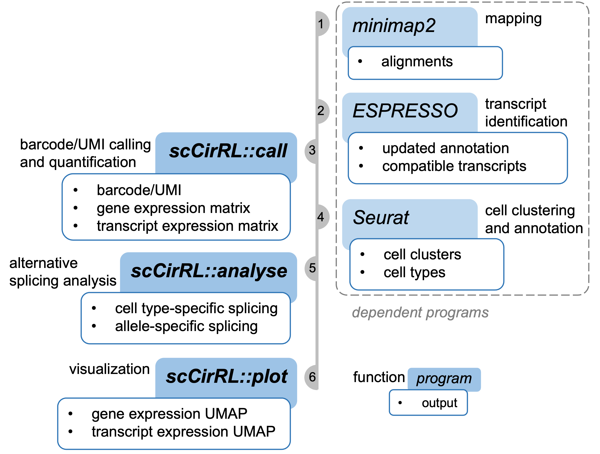

# scCirRL: <ins>s</ins>ingle-<ins>c</ins>ell <ins>C</ins>haracterization of <ins>i</ins>soform <ins>r</ins>egulation using <ins>R</ins>NA-seq <ins>L</ins>ong reads

<!-- [](https://github.com/xinglab/scCirRL/releases/latest) -->
<!-- [](https://github.com/xinglab/scCirRL/releases) -->
<!-- [](https://anaconda.org/bioconda/scCirRL) -->
<!-- [](https://pypi.python.org/pypi/scCirRL) -->
<!-- [](https://dx.doi.org/10.1093/bioinformatics/btaa963) -->
<!-- [](https://github.com/xinglab/scCirRL/issues) -->
<!-- [](https://github.com/xinglab/scCirRL/blob/main/LICENSE) -->
## TODO: add one-line command to run, 1) barcode calling, 2) cell-type splicing, 3) allele-specific splicing
## Updates (v0.0.1)

- First version

## What is scCirRL
scCirRL is an analysis pipeline designed for single-cell RNA-seq long-read data.
It mainly consists of two parts:
1. cell barcode/UMI calling: a standalone module for barcode/UMI calling and gene/transcript quantification
2. alternative splicing analysis: modules for identification of cell type-specific and allele-specific splicing



## Table of Contents
- [scCirRL: single-cell Characterization of isoform regulation using RNA-seq Long reads](#sccirrl-single-cell-characterization-of-isoform-regulation-using-rna-seq-long-reads)
  - [TODO: add one-line command to run, 1) barcode calling, 2) cell-type splicing, 3) allele-specific splicing](#todo-add-one-line-command-to-run-1-barcode-calling-2-cell-type-splicing-3-allele-specific-splicing)
  - [Updates (v0.0.1)](#updates-v001)
  - [What is scCirRL](#what-is-sccirrl)
  - [Table of Contents](#table-of-contents)
  - [Installation](#installation)
    - [Operating system and python version](#operating-system-and-python-version)
    - [Via conda (install locally for now)](#via-conda-install-locally-for-now)
    - [Via pip (not work yet)](#via-pip-not-work-yet)
    - [From source files](#from-source-files)
  - [0. Preprocessing](#0-preprocessing)
    - [0.1 Mapping](#01-mapping)
    - [0.2 Transcript identification](#02-transcript-identification)
  - [1. Barcode \& UMI calling](#1-barcode--umi-calling)
    - [1.1 Input](#11-input)
    - [1.2 Command](#12-command)
    - [1.3 Output](#13-output)
  - [2. Cell clustering and annotation](#2-cell-clustering-and-annotation)
  - [3. Cell type-specific splicing analysis](#3-cell-type-specific-splicing-analysis)
    - [3.1 Input](#31-input)
    - [3.2 Command](#32-command)
    - [3.3 Output](#33-output)
  - [4. Allele-specific splicing analysis](#4-allele-specific-splicing-analysis)
    - [4.1 Phase long reads with `whatshap`](#41-phase-long-reads-with-whatshap)
    - [4.2 Identify allele-specific splicing](#42-identify-allele-specific-splicing)
    - [4.3 Identify disease-associated GWAS SNPs from allele-specific spliced genes](#43-identify-disease-associated-gwas-snps-from-allele-specific-spliced-genes)
  - [5. Visualization](#5-visualization)
    - [5.1. UMAP plot of gene VIM and EPCAM](#51-umap-plot-of-gene-vim-and-epcam)
    - [5.2. UMAP plot of CD44 transcripts](#52-umap-plot-of-cd44-transcripts)
    - [5.3. UMAP plot of both CD44 gene and transcripts](#53-umap-plot-of-both-cd44-gene-and-transcripts)

## Installation
### Operating system and python version
scCirRL was written in python3 and tested on Linux/Unix systems, so it may not work well with python2 and/or other systems(Windows/Mac).

<!-- 
### <a name="dep"></a>~~Dependencies~~ installed via conda
* [minimap2](https://github.com/lh3/minimap2) >= 2.24
* [ESPRESSO](https://github.com/Xinglab/espresso) >= 1.3.1
* [python3](https://www.python.org/) >= 3.8
* [pysam](https://pysam.readthedocs.io/en/latest/) >= 0.21.0
* [edlib](https://pypi.org/project/edlib/) >= 1.3.9
* [kneed](https://pypi.org/project/kneed/) >= 0.8.3
* [scipy](https://scipy.org/) >= 1.10.1
* [rpy2](https://github.com/rpy2/rpy2) >= 3.5.11
* [PyVCF3](https://github.com/dridk/PyVCF3) >= 1.0.3
* [pyinterval](https://pyinterval.readthedocs.io/en/latest/) >= 1.2.0
* [duckdb](https://duckdb.org/docs/api/python/overview.html) >= 0.7.1
* [tabix](https://anaconda.org/bioconda/tabix)
* [whatshap](https://whatshap.readthedocs.io/en/latest/index.html) >= 1.7

(Optional) For rolling circle amplification (RCA) single-cell long-read data:
* [TideHunter](https://github.com/yangao07/TideHunter) >= 1.5.4 
-->

### Via conda (install locally for now)
```
git clone git@github.com:Xinglab/scCirRL.git
cd scCirRL
conda create --prefix ./conda_env
conda activate ./conda_env
conda install -c conda-forge -c bioconda python=3.8 --file conda_requirements.txt
python setup.py install
```

<!-- ```
conda create -n scCirRL-env python=3.8 scCirRL
conda activate scCirRL
``` -->

### Via pip (not work yet)
```
pip install scCirRL
```

### From source files
```
git clone git@github.com:Xinglab/scCirRL.git
cd scCirRL pip install .
```

## 0. Preprocessing

<!-- ### 0.0 Consensus calling
For RCA long-read data, consensus sequences need to be first called from RCA long reads using [TideHunter](https://github.com/yangao07/TideHunter)(≥1.5.4).

The generated consensus sequences can then be mapped to the reference genome as 1D long reads.

* Input
  * `rca_long_read.fq`: RCA long-read fasta/fastq file
  * `five_prime.fa`, `three_prime.fa`: 5' and 3' sequences of RCA library. If a splint sequence was used, please split the splint sequence into two halves and use them as 5' and 3' sequences. Note that both 5' and 3' sequences need to have an orientation of 5'->3', i.e., the 3' sequence needs to be reverse-complement

* Command
```
TideHunter rca_long_read.fq \
           -5 five_prime.fa \
           -3 three_prime.fa \
           -lF -t 16 \
           -o consensus.fa
``` -->

### 0.1 Mapping
For mapping, we recommend using [minimap2](https://github.com/lh3/minimap2) in RNA splice mode.
Any other long-read RNA-seq alignment tools can also be used here.

* Input
  * `long_read.fq/fa`: 1D long reads or RCA consensus sequences in fastq/fasta format
  * `ref.fa`: reference genome
  * (optional) `anno.gtf`: gene annotation file in GTF format
  * (optional) `n_threads`: number of threads to use

  
* Command
```
# 1. convert GTF to BED12 using paftools.js from minimap2
paftools.js gff2bed anno.gtf > anno_junc.bed12

# 2. mapping with minimap2
minimap2 ref.fa long_read.fq/fa         \
         --junc-bed anno_junc.bed12     \
         -ax splice -ub -k14 -w4        \
         --sam-hit-only --secondary=no  \
         -t n_threads -o long_read.sam

# 3. convert sam to sorted bam
samtools view long_read.sam -b long_read.bam
samtools sort long_read.bam -@ n_threads -o long_read.sorted.bam
```
### 0.2 Transcript identification
For transcript identification, we recommend using [ESPRESSO(≥1.3.1)](https://github.com/Xinglab/espresso), other tools like [Bambu](https://github.com/GoekeLab/bambu) or [IsoQuant](https://github.com/ablab/IsoQuant) can also be used.
* Input
  * `long_read.sorted.bam`: sorted long-read alignment file in BAM format
  * `ref.fa`: reference genome file in FASTA format
  * `anno.gtf`: gene annotation file in GTF format 
  * `esp_output_dir`: output directory
* Output
  * `esp_output_dir/esp_cmpt.tsv`: compatible isoforms for all reads
  * `esp_output_dir/for_esp_input_N2_R0_updated.gtf`: updated GTF annotation
* Command
```
# 1. create tab-separated input file for ESPRESSO
mkdir esp_output_dir 2> /dev/null
in_tsv=esp_output_dir/for_esp_input.tsv
abs_path=$(realpath long_read.sorted.bam)
base_name=$(basename long_read.sorted.bam)
echo -e "$abs_path\t$base_name" > $in_tsv

# 2. ESPRESSO S step
perl ESPRESSO_S.pl -L esp_output_dir/for_esp_input.tsv  \
                   -F ref.fa -A anno.gtf            \
                   -M notFilterOutchrM -T n_threads \
                   -O esp_output_dir

# 3. ESPRESSO C step
perl ESPRESSO_C.pl -I esp_output_dir -F ref.fa \
                   -X 0 -T n_threads

# 4. ESPRESSO Q step
perl ESPRESSO_Q.pl -L esp_output_dir/for_esp_input.updated \
                   -A anno.gtf -T n_threads            \
                   -V esp_output_dir/esp_cmpt.tsv
```

**Note that `-V esp_cmpt.tsv` is optional in `ESPRESSO Q` step, but it is required if you want scCirRL to output gene/transcript quantification information.**

## 1. Barcode & UMI calling
scCirRL identifies barcode and UMI from sorted alignment BAM file of single-cell long reads ***without*** using reference barcode from short-read data. 

### 1.1 Input 
* Required:
  * `long_read.sorted.bam`: sorted long-read BAM (recommend using [minimap2](https://github.com/lh3/minimap2))
* Optional:
  * `read_isoform_compatible.tsv`: tabular file of compatible isoforms for all reads, generated by [ESPRESSO(≥1.3.1)](https://github.com/Xinglab/espresso), [Bambu](https://github.com/GoekeLab/bambu) or [IsoQuant](https://github.com/ablab/IsoQuant)
  * `updated.gtf`: updated GTF annotation, generated by [ESPRESSO(≥1.3.1)](https://github.com/Xinglab/espresso), [Bambu](https://github.com/GoekeLab/bambu) or [IsoQuant](https://github.com/ablab/IsoQuant)
  * `annotation.gtf`: reference annotation GTF file, to retrieve gene names if gene names are not provided in `updated.gtf`
  * `cell_barcode.tsv`: reference cell barcode list. If provided, scCirRL will directly use it to guide the barcode calling, only long reads with cell barcodes in the provided list will be kept
  * barcode sequence length (default: 16)
  * max. allowed edit distance between barcode and reference barcode (default: 2)
  * UMI sequence length (default: 12)
  * max. allowed edit distance between PCR-duplicated UMIs (default: 1)

### 1.2 Command
```
scCirRL long_read.sorted.bam \
        output_dir           \
        -t updated.gtf       \
        -m read_isoform_compatible.tsv \
        -g annotation.gtf
```
### 1.3 Output
* `bc_umi.bam`: BAM file with barcode/UMI information for each long read, BAM tags: `CB` and `UB`, for barcode and UMI.  Note that only long read with barcode/UMI called are kept
* `bc_umi.tsv`: tabular file with barcode/UMI/gene/transcript information for all barcode-called long reads
* `expression_matrix/`: folder containing 10X format sparse expression matrix at both gene and transcript level, can be directly parsed using standard single-cell analysis tools, like [Seurat](https://satijalab.org/seurat/)/[Azimuth](https://satijalab.github.io/azimuth/articles/run_azimuth_tutorial.html)
* `ref_bc.tsv`: reference cell barcode list identified from long reads. Note that if cell barcode list was provided to scCirRL, `ref_bc.tsv` file will not be generated
* `high_qual_bc_umi.rank.tsv`: cell barcode list ranked by unique UMI count based on all high-quality long reads. Note that if cell barcode list was provided to scCirRL, `high_qual_bc_umi.rank.tsv` file will not be generated
  
Example of `bc_umi.tsv`:

| cell barcode | UMI | # reads | compatible transcript id | gene id | gene name | read names (separeted by \`,\`)|
|-|-|-|-|-|-|-|
| ATCACGACACTTTAGG | ATCACATCCATG | 3 | ENST00000407249, ENST00000341832 | ENSG00000248333 | CDK11B | 741aa2c2-5840-4a29-bd90-3bdcb71604ba, 05f8432a-7f7e-446d-a6d5-8ab9e4eb5102, 6bb13ee1-7397-435c-8840-aeb2a90cf4ab |


## 2. Cell clustering and annotation
All the downstream single-cell long-read analyses rely on the cell type clustering result, which could be accomplished by running [Seurat](https://satijalab.org/seurat/) on the gene expression matrix.

Annotating the cell clusters is the process of assigning cell types to each cell cluster. This could be performed manually or based on known reference annotation like [Azimuth](https://satijalab.github.io/azimuth/articles/run_azimuth_tutorial.html).

For example, for human peripheral blood mononuclear cells (PBMC), the clustering and annotation result can be obtained by mapping to the Azimuth human PBMC reference dataset. 
<!-- (https://github.com/Xinglab/scCirRL/tree/main/scripts_for_paper#run_azimuth.R) -->
We provide an example [R script](scripts_for_paper/README.md#run_azimuth_pbmcr) for human PBMC data. For data from other species/tissues, this needs to be done manually by users.

**Note that not having cell clusters annotated with cell types does not affect the downstream splicing analyses by scRMATS-long.
You can simply provide scRMATS-long with the cluster IDs for cell barcodes.**

Here is an example of the output file for this step, `bc_to_cell_type.tsv`:

|barcode| cell type|
|-|-|
| TACGCCGAGCAGGCCA | CD4 T|
| ACGATCGAGGCATCAG | Mono |
| ... | ...|

Or, if no cell type annotation was available:
|barcode| cluster ID|
|-|-|
| TACGCCGAGCAGGCCA | 1|
| ACGATCGAGGCATCAG | 2|
| ... | ...|


## 3. Cell type-specific splicing analysis
scRMATS-long performs ***pairwise comparison*** to identify differentially spliced genes/transcripts between each two cell types/clusters.
### 3.1 Input
* Required
  * `expression_matrix/transcript`: transcript count matrix directory, generated by scCirRL
  * `bc_to_cell_type.tsv`: list of barcode and corresponding cell type or cluster ID, generated by [Seurat](https://satijalab.org/seurat/)/[Azimuth](https://satijalab.github.io/azimuth/articles/run_azimuth_tutorial.html)
  * `out_prefix`: prefix of output files
* Optional
  * min. number of reads to keep a transcript for each cell type (default: 10)
  * min. number of transcripts to keep a gene for each cell type (default: 2)
  * list of genes of interest. If provided, all genes will still be processed, but only differentially spliced genes that are in this list will be output
### 3.2 Command
```
cell_type_specific_splicing expression_matrix/transcript \
                            bc_to_cell_type.tsv          \
                            out_prefix
```

### 3.3 Output
* `*_cell_spliced_genes.tsv`: differentially spliced genes between 2 cell types. Gene FDR ≤0.05, max. delta ratio ≥0.05
* `*_cell_spliced_transcripts.tsv`: differentially spliced transcripts between 2 cell types. Gene FDR ≤0.05, transcript p value ≤0.05, delta ratio ≥0.05

Example of `*_cell_spliced_genes.tsv`:

| cell_type1| cell_type2|gene_id| gene_name| gene_fdr| max_delta_ratio| transcript_ids| cell1_counts| cell2_counts| cell1_ratios| cell2_ratios|
|-|-|-|-|-|-|-|-|-|-|-|
|Epithelial| Mesenchymal|ENSG00000026508| CD44| 7.96e-65| 0.68| ENST00000263398, ENST00000433892, ENST00000527326, ESPRESSO:chr11:443:2, ESPRESSO:chr11:443:3| 61.43,122.97, 20.0,23.41,13.63| 322.74,4.24,15.0,1.33-05,1.33e-05| 0.25,0.50,0.08,0.09,0.05| 0.94,0.01,0.04,3.89e-08,3.89e-08 |

Example of `*_cell_spliced_transcripts.tsv`:

| cell_type1| cell_type2 | gene_id| gene_name| transcript_id| gene_fdr| transcript_p| delta_ratio| count1| count2| ratio1| ratio2|
|-|-|-|-|-|-|-|-|-|-|-|-|
| Epithelial| Mesenchymal| ENSG00000026508| CD44| ENST00000263398| 7.96e-65| 8.25e-73| 0.68| 61.43| 322.74| 0.25| 0.94|


## 4. Allele-specific splicing analysis
With additional whole-genome sequencing data, scRMATS-long can identify allele-specific splicing within each cell type.
The allele-specific splicing analysis mainly consists of three steps:
1. Phase long reads with whatshap
2. Identify allele-specific spliced genes/transcripts within each cell type
3. Search for disease-associated GWAS SNPs from identified allele-specific spliced genes

### 4.1 Phase long reads with `whatshap`
* Input
  * `wgs_phased.vcf`: WGS phased VCF file, generated from WGS short-read data using [GATK](https://gatk.broadinstitute.org/hc/en-us) and [SHAPEIT](https://odelaneau.github.io/shapeit5/)
  * `ref.fa`: reference genome fasta file
  * `bc_umi.bam`: BAM file with barcode/UMI information, generated by scCirRL
* Command
```
# sort and index `bc_umi.bam`
samtools sort bc_umi.bam -o bc_umi_sorted.bam
samtools index bc_umi_sorted.bam

# identify haplotype
whatshap haplotag wgs_phased.vcf bc_umi_sorted.bam \
                  --reference ref.fa               \
                  --ignore-read-groups             \
                  --skip-missing-contigs           \
                  -o bc_umi_hap.bam                \
                  --output-haplotag-list hap_list.tsv
```
* Output
  * `bc_umi_hap.bam`: BAM file with barcode/UMI and additional haplotype information
  * `hap_list.tsv`: tabular file containing haplotype information for barcode-called long reads
  
### 4.2 Identify allele-specific splicing
* Input
  * `bc_umi.tsv`: tabular file with barcode/UMI/gene/transcript information, generated by scCirRL
  * `hap_list.tsv`: tabular file containing haplotype information, generated by [whatshap](https://whatshap.readthedocs.io/en/latest/index.html), see [above](#41-phase-long-reads-with-whatshap)
  * `bc_to_cell_type.tsv`: list of barcode and corresponding cell type or cluster ID, generated by [Seurat](https://satijalab.org/seurat/)/[Azimuth](https://satijalab.github.io/azimuth/articles/run_azimuth_tutorial.html) 

* Command
```
allele_specific_splicing bc_umi.tsv \
                         bc_to_cell_type.tsv \
                         hap_list.tsv \
                         output_prefix

```
* Output
  * `*_allele_spliced_genes.tsv`: allele-specific spliced genes. Gene FDR ≤0.05, max. delta ratio ≥0.05
  * `*_allele_spliced_transcripts.tsv`: allele-specific spliced transcripts. Gene FDR ≤0.05, transcript p value ≤0.05, delta ratio ≥0.05
  
Example of `*_allele_spliced_genes.tsv`:
|cell_type| gene_id| gene_name| gene_fdr| transcripts| hap1_counts| hap2_counts| hap1_ratios| hap2_ratios|
|-|-|-|-|-|-|-|-|-|
|Mono| ENSG00000105383| CD33| 4.42e-07| ENST00000262262, ENST00000421133| 58,9| 24,41| 0.86,0.13| 0.36,0.63|

Example of `*_allele_spliced_transcripts.tsv`:
|cell_type| transcript_id| transcript_p| gene_id| gene_name| gene_fdr| hap1_count| hap2_count| hap1_ratio| hap2_ratio|
|-|-|-|-|-|-|-|-|-|-|
|Mono| ENST00000262262| 3.58e-09| ENSG00000105383| CD33| 4.42e-07| 58| 24| 0.86| 0.36|

### 4.3 Identify disease-associated GWAS SNPs from allele-specific spliced genes
* Input
  * `*_allele_spliced_genes.tsv`: allele-specific spliced genes, generated by [allele_specific_splicing](#42-identifiy-allele-specific-splicing)
  * `wgs_phased.vcf`: WGS phased VCF file, generated from WGS short-read data using [GATK](https://gatk.broadinstitute.org/hc/en-us) and [SHAPEIT](https://odelaneau.github.io/shapeit5/)
  * `annotation.gtf`: annotation GTF file
  * `gwas_catalog_efo.tsv`: GWAS catalog database with EFO term
  * `ld.duckdb`: linkage disequilibrium (LD) score database in duckdb format

* Command
```
gene_with_gwas_disease -g allele_spliced_genes.tsv \
                       annotation.gtf       \
                       wgs_phased.vcf       \
                       gwas_catalog_efo.tsv \
                       ld.duckdb            \
                       output_prefix
```

* Output
  <!-- * `*_allele_spliced_gene_gwas.tsv`: GWAS disease-associated genes -->
  * `*_allele_spliced_gene_gwas_efo_term.tsv`: GWAS disease-associated genes, with traits described in [EFO](https://www.ebi.ac.uk/efo/) term
  <!-- * `*_allele_spliced_gene_gwas_detailed.tsv`: GWAS and LD information of all SNPs -->
  * `*_allele_spliced_gene_gwas_ld`: directory of LD scores and GWAS traits for all SNPs, each gene has one separate `.ld` file
  
<!-- Format of `*_allele_splice_gwas_detailed.tsv`:
|snp_id| gene_name| gene_id| haplotype| gwas_trait| gwas_efo_term| ld_trait| ld_efo_term| ld_snps| ld_scores|
|-|-|-|-|-|-|-|-|-|-|
|rs3865444| CD33| ENSG00000105383| H2| Alzheimer disease| Neurological disorder| NA, Alzheimer disease, late-onset Alzheimer's disease, NA, NA| NA, Neurological disorder, Neurological disorder, NA, NA| rs12459419, rs7245846, rs1354106, rs34813869, rs33978622| 1.0,0.89,0.88,0.88,0.96| -->

Example of `*_allele_splice_gwas_efo_term.tsv`:
|gene_name| gene_id| Cancer| Immune system disorder| Neurological disorder| Cardiovascular disease| Digestive system disorder| Metabolic disorder| Response to drug| Other disease|
|-|-|-|-|-|-|-|-|-|-|
|CD33| ENSG00000105383| False| False | True | False| False| False| False| False|

Example of `*_allele_spliced_gene_gwas_ld/gene.ld`:
|snp_id| rs3865444| rs2459141| rs12459419| rs2455069| rs7245846| rs33978622| rs34813869| rs1354106| haplotype| chrom| pos| type| gwas_trait| gwas_trait_efo_term| gwas_pvalue|
|-|-|-|-|-|-|-|-|-|-|-|-|-|-|-|-|
|rs3865444| 1.0| 0.326844| 1.0| 0.327703| 0.891224| 0.967195| 0.887773| 0.881092| H2| chr19| 51224706| gwas| Alzheimer disease| Neurological disorder| 2e-09

## 5. Visualization
Given genes/transcripts of interest (cell-type-specific splicing/allele-specific spciling), scRMATS-long also offers visualization of your results in the single-cell UMAP space, based on the Seurat R package.

```
# gene/transcript expression folder generated by scCirRL
gene_mtx <- "output_dir/expression_matrix/gene"
transcript_mtx <- "output_dir/expression_matrix/transcript"
# script for UMAP plot
source("visualization.R)
```

### 5.1. UMAP plot of gene VIM and EPCAM
```
scCirRL_umap_plot(gene_mtx_dir = gene_mtx,
                  # `feature_mtx_dir` needs to be only one folder/object or the same size as `feature_list`
                  feature_mtx_dir = gene_mtx,
                  feature_list = c("VIM", "EPCAM"))
```


### 5.2. UMAP plot of CD44 transcripts
```
scCirRL_umap_plot(gene_mtx_dir = gene_mtx,
                  # `feature_mtx_dir` needs to be only one folder/object or the same size as `feature_list`
                  feature_mtx_dir = transcript_mtx,
                  feature_list = c("ENST00000433892", "ENST00000263398"))
```


### 5.3. UMAP plot of both CD44 gene and transcripts
```
scCirRL_umap_plot(gene_mtx_dir = gene_mtx,
                  # `feature_mtx_dir` needs to be only one folder/object or the same size as `feature_list`
                  feature_mtx_dir = c(gene_mtx, transcript_mtx, transcript_mtx),
                  feature_list = c("CD44", "ENST00000433892", "ENST00000263398"))
```


Note that, for `gene_mtx_dir` and `feature_mtx_dir`, you can also provide with Seurat object instead of a matrix folder.

```
gene_obj = make_seurat_obj(gene_mtx)
transcript_obj = make_seurat_obj(transcript_mtx)

scCirRL_umap_plot(gene_mtx_dir = gene_obj,
                  # `feature_mtx_dir` needs to be only one folder/object or same size as `feature_list`
                  feature_mtx_dir = c(gene_obj, transcript_obj, transcript_obj),
                  feature_list = c("CD44", "ENST00000433892", "ENST00000263398"))
```
